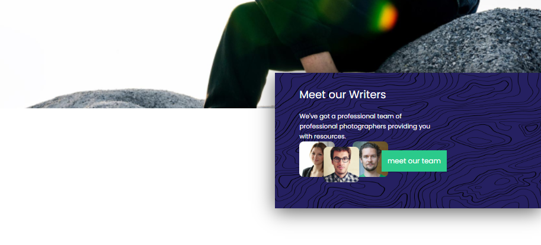
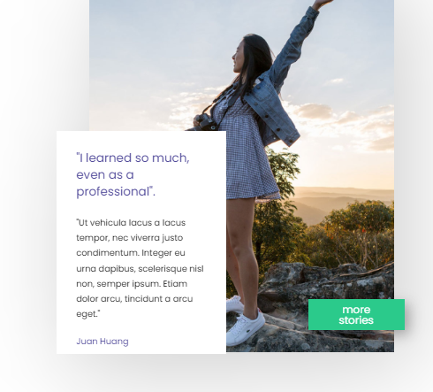
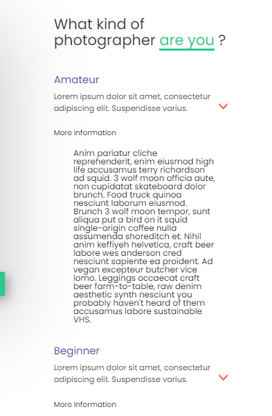
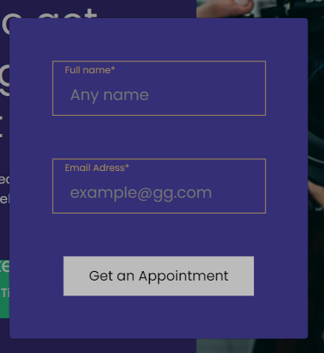

# Resource (My third PET-project)

[Here you can check it](https://artemuholkov.github.io/Resource/)

---

I had figma design for this project.
This landing page is 100% responsive for all types of screens.
I used HTML, CSS, JS in this project.

---

### What was interesting in this project:

1. Search bar with validation

2. Absolute elements positioning.

3. Boostrap dropdowns

4. Modal with form, form with validation

---
